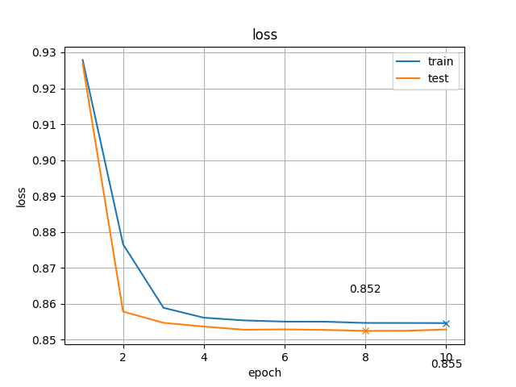

# Autoencoder (自己符号化器)

MNIST データセットに対して自己符号化器を実装し，ノイズ除去を行った．

設定は以下の通り．

- 自己符号化器 (`784-80-784`)
- 活性化関数は中間層に `ReLU`，出力層に `Sigmoid`
- 損失は `MSE` (平均二乗誤差)
- オプティマイザは `Adam`
- パラメータは `(epoch, lr, decay, batch_size) = (10, 5e-3, 8e-6, 50)`

この設定で学習した結果の損失の変化は 次の図の通りである．
5 epoch ぐらいまでは単調に減少していて，学習が進んでいることがわかる．

学習した自己符号化器を用いてノイズ除去の実験を行った結果を 下に示す． 
左図は `1 割の点をランダムに選んで白にする`というノイズを追加した場合で，右図は`標準偏差 0.3 のガウシアンノイズ`を追加した場合の結果を表している． 
両方の図においてノイズがしっかり除去されていることから，自己符号化器において画像の特徴が学習されて，ノイズの影響を受けない状態の出力が得られていることがわかる．

 