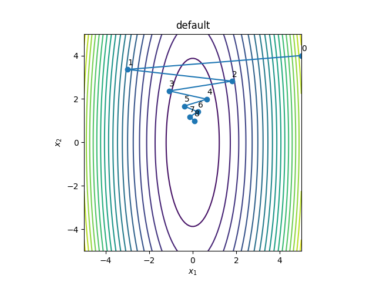
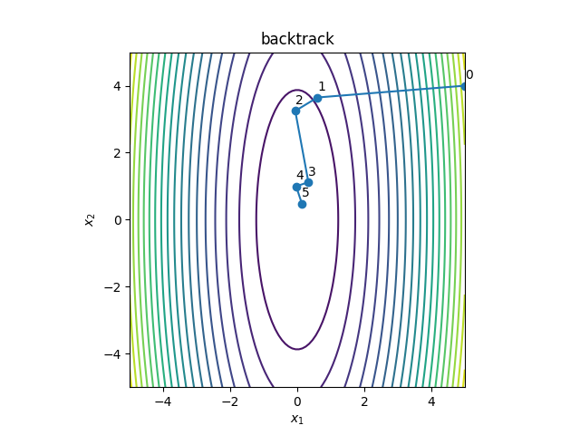

# Backtracking Line Search (バックトラック直線探索)

 に対するバックトラック直線探索を用いた勾配法の実装を行った． 
アルミホ基準が成り立つまでステップ幅を減衰させることで，反復回数を削減．

左がステップ幅を 0.08 に固定したときの探索結果で，右がバックトラック直線探索を行った結果である． 
確かに，バックトラック直線探索を行った方が収束が早くなっていることがわかる．

 
