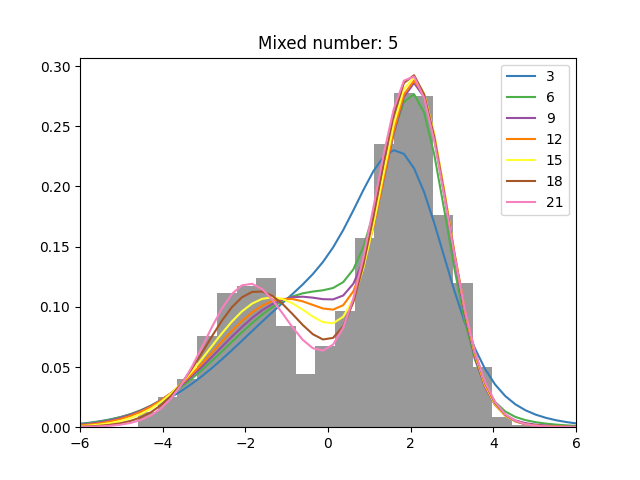
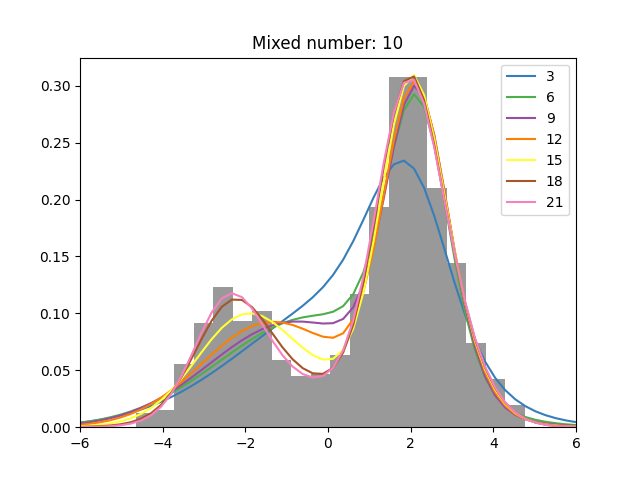

# Expectation-Maximization Algorithm (EM アルゴリズム)

ガウス混合モデルに対する EM アルゴリズムを実装し，確率密度関数を推定した．

グラフのヒストグラムは実際に生成されたデータのもので，各曲線は今回の実装で得られたガウス混合モデルの曲線である． 
それぞれの曲線の凡例は繰り返しの何番目のものかを表している． 
今回はパラメータの差のノルムが 1e−2 より小さくなるまで反復を行った． 
混合数を変えてもあまり反復回数は変わらなかったが，計算速度は混合数が多いほど長くなった．

 