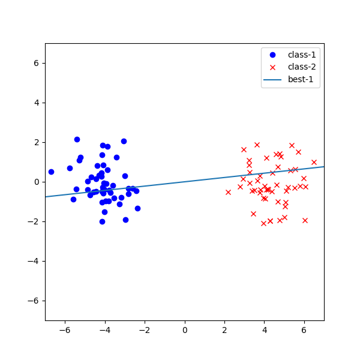
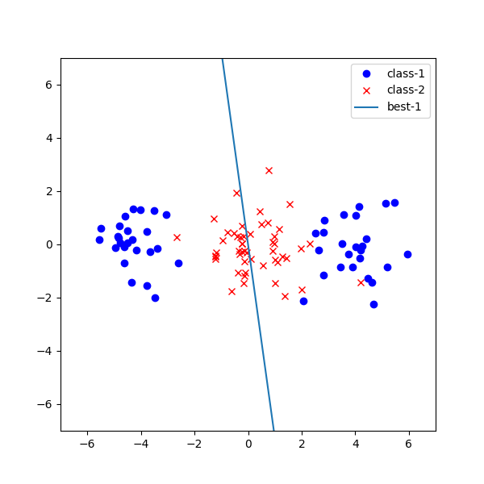

# Fisher Discriminant Analysis (フィッシャー判別分析)

2クラスデータに対するクラス間の分離性を保持したフィッシャー判別分析を実装した．

左図のようにクラスタが二つに綺麗に分れている時はしっかりと分離できていることがわかる． 
一方，右図のようにクラス内にクラスタがあるような場合には，うまく分離できていないこともわかる． 
これを解決するために局所 FDA (LFDA) や半教師付き LFDA などが用いられることもある．

 