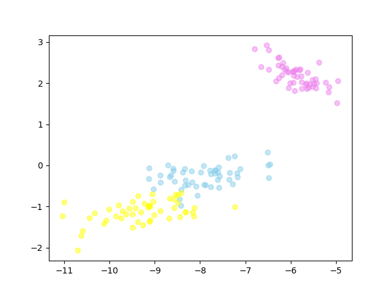
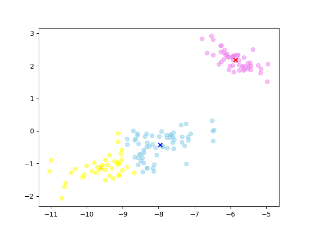
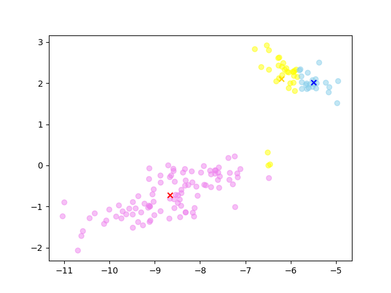

# K-Means Clustering (k 平均クラスタリング)

`iris` のデータセットに対する k 平均クラスタリングを実装した．

まず，元の 4 次元データを `PCA` (主成分分析) を用いて，2 次元に圧縮した結果左図のようになった． 
色分けはデータセットの `target` を用いて同じクラスターに属するものが同じ色になるように分けた．

それを元に k 平均クラスタリングで分類すると真ん中の図のようになる． 
しかし，3 つのクラスターに分けるときに初期値の値によってうまく行かず，右図のような結果になることもある．

  