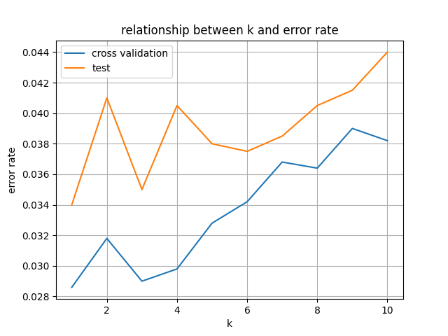
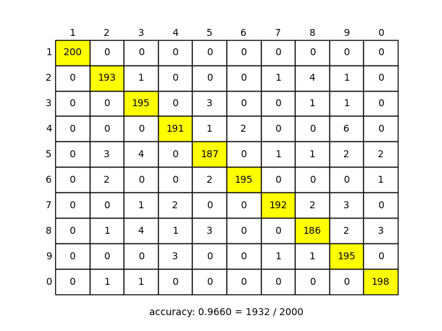

# K Nearest Neighbor Classification (最近傍識別)

近傍数 k を交差確認法により決定し，k 近傍識別器を用いて手書き数字のパターン認識を実装した．

データセットは `digit.mat` を使用した．

交差確認法と実際のテストケースでの認識結果の誤答率を示したものが左図である． 
交差確認法によって `k = 1` が最も誤答率が低く，最適な近傍数であるとわかるが，実際のテストケースでも `k = 1` のときが最も誤答率が低かったので，交差確認法で決定した近傍数は確かに最適なものであったとわかる．

正解率は `0.9660 = 1932 / 2000` であり，**96 %** 以上の正答率となる． 
[最小二乗分類](../Least-Squares-Classification) と同じ精度であり，処理速度は [線形判別分析](../Linear-Discriminant-Analysis) ほどではないが，高速である． 
縦軸を正解のカテゴリ，横軸を予測したカテゴリとした時の予測結果は以下のようになった．

 