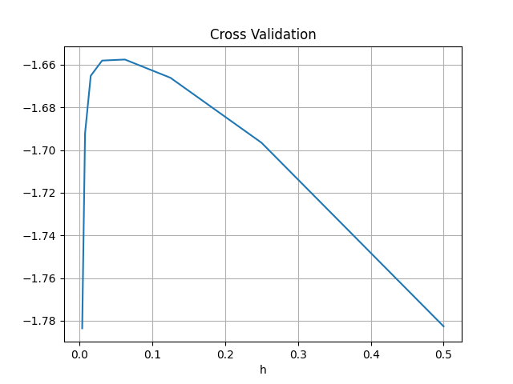
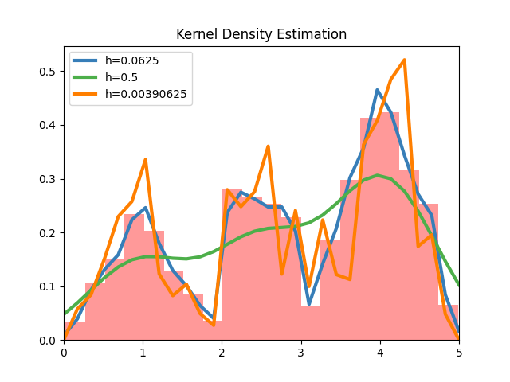

# Kernel Density Estimation (カーネル密度推定法)

尤度交差確認法でバンド幅 h を推定し，ガウスカーネルに対するカーネル密度推定法を実装した．

`h = 0.03125` の時最適となり，右図の青線のようにうまく適合したグラフになるが，それより大きいときは緑線のようにあまり元のデータに適合せず，それより小さいときはオレンジの線のように元のデータに過適合してギザギザなグラフになることがわかる．

 