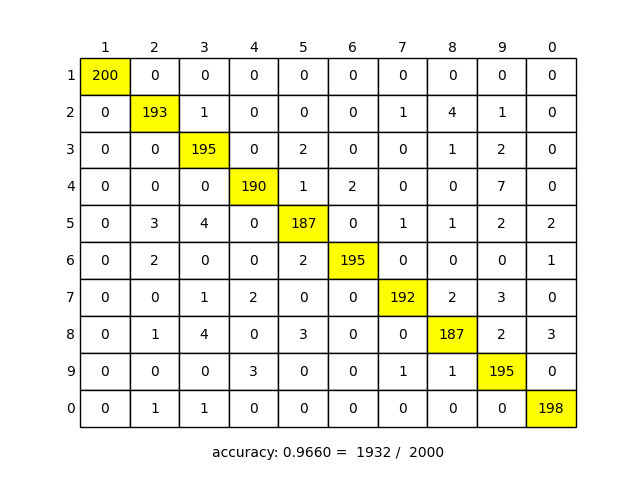

# Least Squares Classification (最小二乗分類)

ガウスカーネルモデルに対する一対他の最小二乗回帰を用いた手書き数字のパターン認識を実装した．

データセットは `digit.mat` を使用した． 
PC のスペックによっては**実行にかなり時間がかかる**ため注意

ハイパーパラメータは `(h, l) = (0.5, 0.01)` を使用した．

正解率は `0.966 = 1932 / 2000` であり，**96 %** 以上の正答率となる． 
[最近傍識別](../K-Nearest-Neighbor-Classification) と比べて，精度は同じだが，処理速度は遅い．
縦軸を正解のカテゴリ，横軸を予測したカテゴリとした時の予測結果は以下のようになった．

