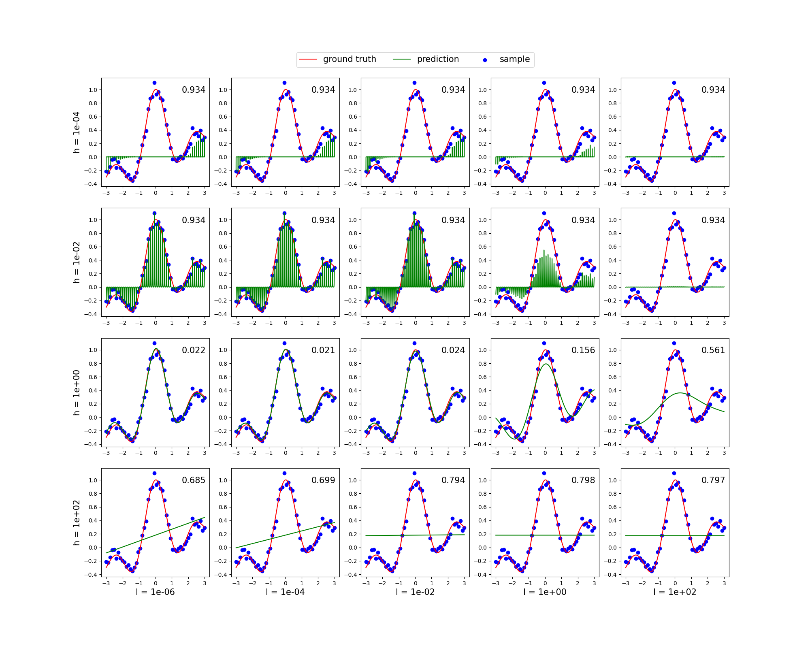

# Least Squares Regression (最小二乗回帰)

ガウスカーネルモデルに対する l2 正則化を用いた最小二乗回帰の交差確認法を行った．

## 条件
訓練標本は 10 データずつ 5 つのグループに分割した． 
テスト誤差としては二乗誤差を用いており，各グラフの右上にその値を示している.

## パラメータ
これらのパラメータの中では最も誤差の小さい `(h, l) = (1, 1e−4)` が最適であると考えられる. 
l の値が大きくなるほど，正則化の影響が大きくなるので，0 に近い値しか取らなくなる． 
h の値が小さくなるとカーネルが小さくなり，狭い範囲の影響しか考慮しなくなってしまうため過適合を起こし，データ点があるところだけ飛び出るようなグラフになってしまう． 
一方，h が大きくなると，広い範囲の影響を考慮しすぎてしまい，学習がうまくいかなくなる．

