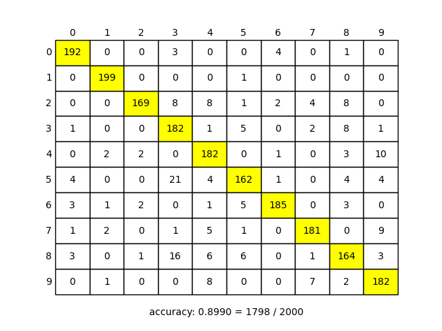

# Linear Discriminant Analysis (線形判別分析)

線形判別分析を用いて手書き数字のパターン認識を実装した．

データセットは `digit.mat` を使用した．

正解率は `0.8990 = 1798 / 2000` であり，**90 %** 近い正答率となる． 
[最小二乗分類](../Least-Squares-Classification) を用いたものと比べると精度は劣るが，処理速度は高速である． 
縦軸を正解のカテゴリ，横軸を予測したカテゴリとした時の予測結果は以下のようになった．

