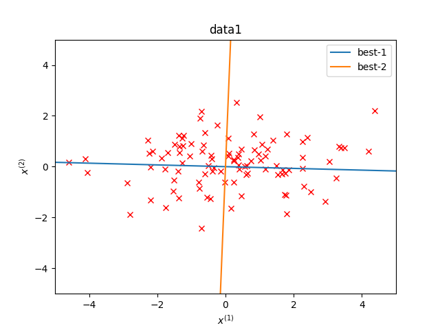
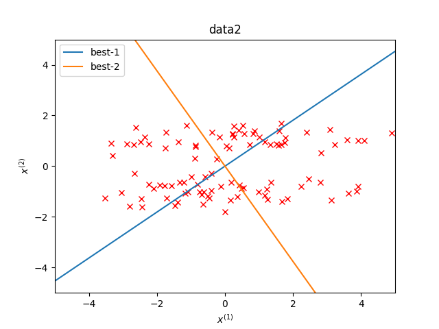
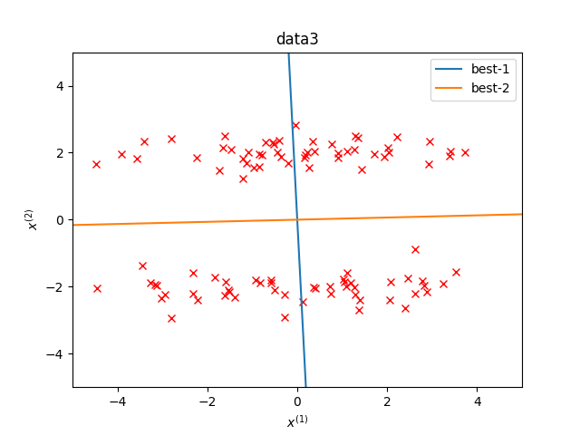

# Locality Preserving Projection

ガウシアン類似度行列に対する局所性保存射影を実装した． 
行列の各要素は具体的には以下のようになっている．

青の best-1 が最適な射影を表す．
- data1: 1つしかクラスタなく，横長のクラスタになっているので横向きに分割されている．
- data2: 少し微妙だが，2つのクラスタをある程度認識して斜めの直線が描かれている．
- data3: クラスタをしっかりと認識して，縦方向の直線が描かれている．

  