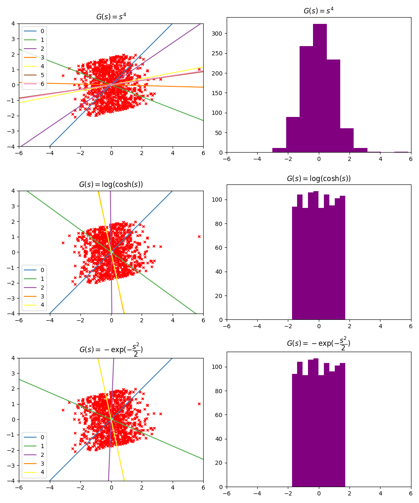

# Projection Pursuit (射影追跡)

近似ニュートンアルゴリズムを用いた射影追跡を実装した．

具体的には ，， の3つの関数について行った．

収束先は順に，(0.99, 0.15), (0.21, -0.98), (0.21, -0.98) となった． 
後ろ2つの関数ではほぼ同じ傾きに収束していて，非ガウス性が強い傾きを得ることに成功しているが，1つ目の関数では外れ値の影響を受けて正しく認識できなかった． 
これはヒストグラムにしても確かめることができて，得られたベクトル方向に正射影したときの原点からの距離を表したヒストグラムにおいて，1つ目は正規分布に近いが，それ以外は一様分布に近いものであると見て取ることができる．

