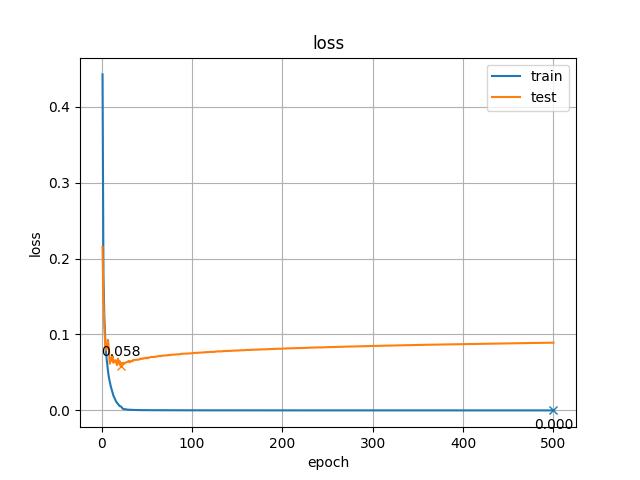
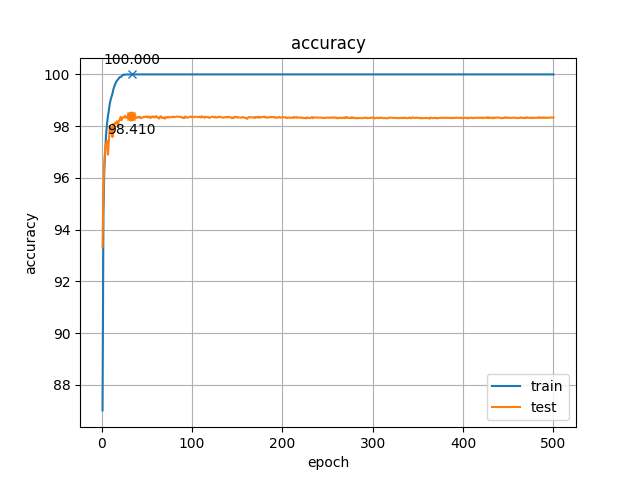
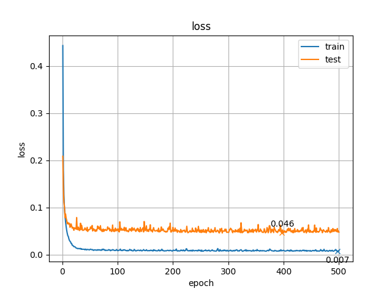
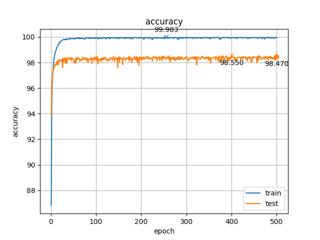
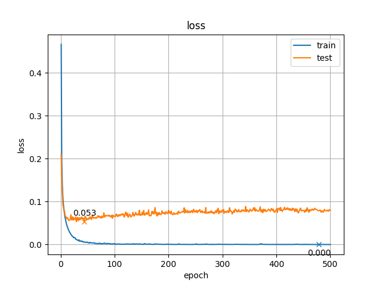
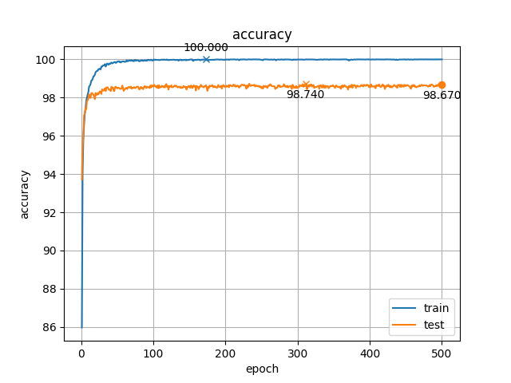
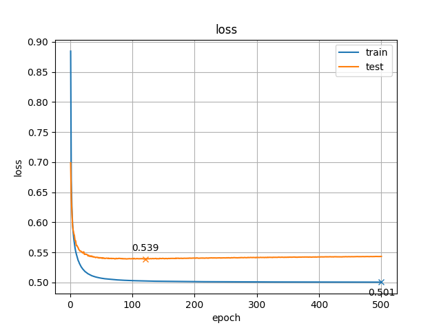
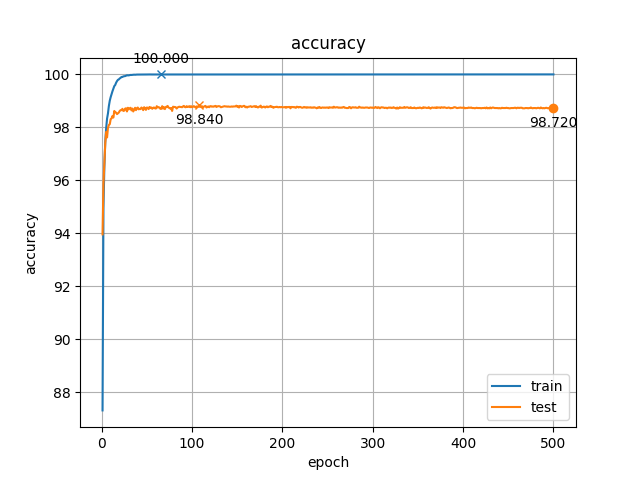
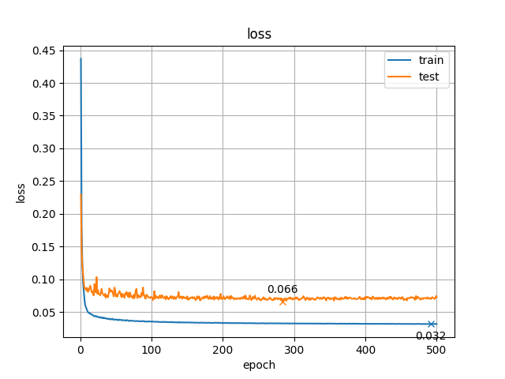
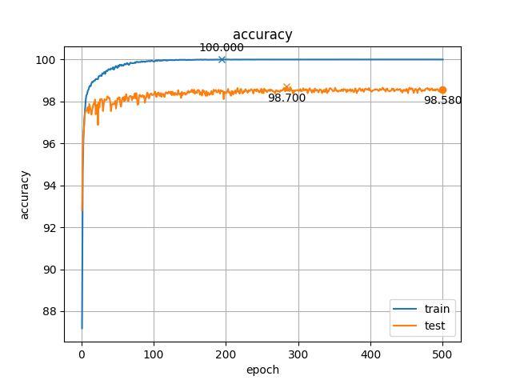

# MNIST Regularization (正則化)

MNIST データセットの多層パーセプトロンに対する複数の正則化手法を実装して，学習の様子を比較した．

`早期終了`，`重み減衰`，`ドロップアウト`，`ラベル平滑化`，`洪水`の 5 つの手法の学習の様子を結果を以下の図に示している．

それぞれの手法を使用するかどうかはコードのパラメータで指定できるようにしており，複数を同時に使用することも可能である． 
重み減衰，ドロップアウト，ラベル平滑化，洪水のパラメータはそれぞれ，`5e-4`，`0.2`，`0.1`，`0.03` とした． 
グラフのバツ印は最も良い結果となる時の値を表していて，丸印はモデルを保存した時の値を表している．

訓練データの損失の値はラベル平滑化と洪水を除いてほぼ 0 になっている．
ラベル平滑化についてはワンホットベクトルで 0 だった部分の値が正の値になっていることから，全体的に値が大きくなっているのかもしれないが，一定の値に収束していることはわかる． 
洪水については下限を 0.03 に設定しているのでそれ以上は下がらないが，その値に収束しているとわかる． 

また，テストデータの損失については早期終了やドロップアウトでは損失が一度下がった後，過学習をして上昇してしまっていることがわかるが，その他の手法では過学習が抑えられていることがわかる． 
正解率の最大値については平滑化が最も高く，ドロップアウト，洪水でもそれについて高い値となっている． 
ただ早期に終了するだけでなく，これらの手法を組み合わせることでさらに精度が向上すると考えられる．

- 早期終了

|  |  |
|:-------------------------------:|:-----------------------------:|
| 損失の変化 | 正解率の変化 |

- 重み減衰

|  |  |
|:-------------------------------:|:-----------------------------:|
| 損失の変化 | 正解率の変化 |

- ドロップアウト

|  |  |
|:-------------------------------:|:-----------------------------:|
| 損失の変化 | 正解率の変化 |

- ラベル平滑化

|  |  |
|:-------------------------------:|:-----------------------------:|
| 損失の変化 | 正解率の変化 |

- 洪水

|  |  |
|:-------------------------------:|:-----------------------------:|
| 損失の変化 | 正解率の変化 |
