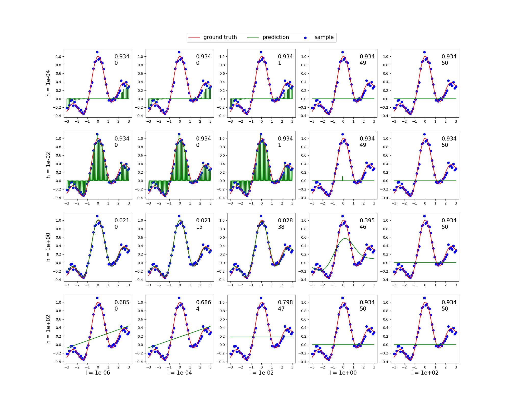

# Sparse Regression (スパース回帰)(Sparse-Regression)

ガウスカーネルモデルに対する交互方向乗数法を用いたスパース回帰の交差確認法を行った．

## 条件
訓練標本は 10 データずつ 5 つのグループに分割した． 
テスト誤差としては二乗誤差を用いており，各グラフの右上にその値を示している． 
また，二乗誤差の下にはパラメータの内ゼロ (との誤差が 1e-5 未満) のものの数を示した．

## パラメータ
これらのパラメータの中では誤差という観点では `(h, l) = (1, 1e-4), (1, 1e-6)` が最も小さくなっているが，ゼロのパラメータの個数はそれほど多くないので，スパース性はあまり生かされていない． 
一方，`(h, l) = (1, 1e-2)` では誤差もほぼ先程の2つと同じで，**ゼロのパラメータも38個**存在するので，スパースであり，かつほぼ同じ結果を得ることができているとわかる． 
以上を考慮すると，`(h, l) = (1, 1e-2)` が最も適切なパラメータだと考えられる．
このときの誤差は 0.021 であり，[最小二乗回帰](../Least-Squares-Regression) とも**ほぼ同じ精度**が得られている．
l と h の値を変化させた時の違いは [最小二乗回帰](../Least-Squares-Regression) を参照．

